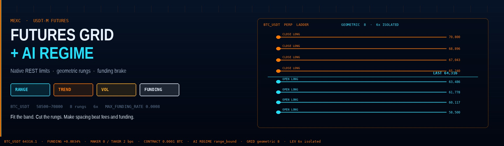
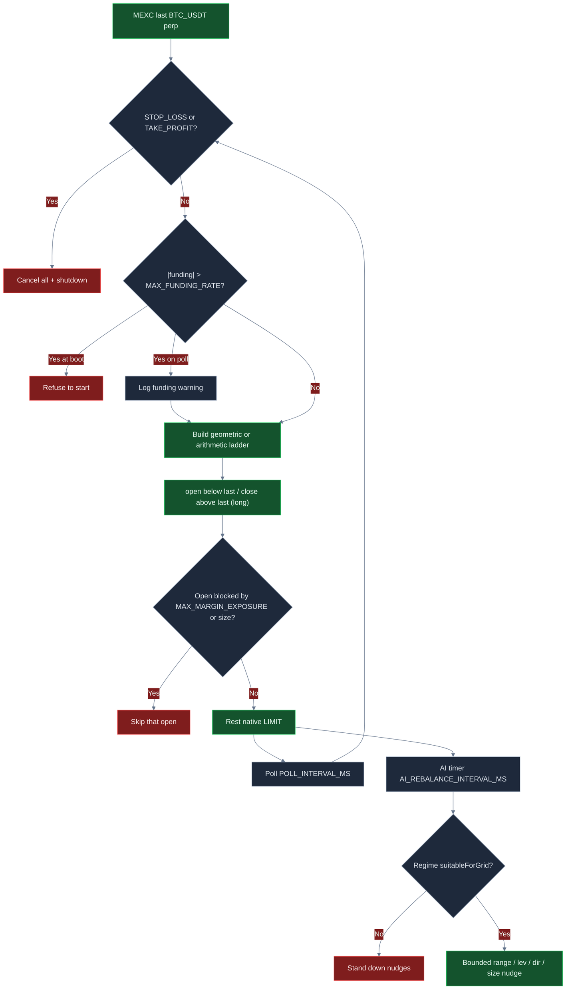
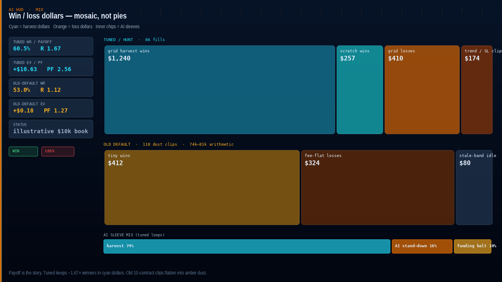
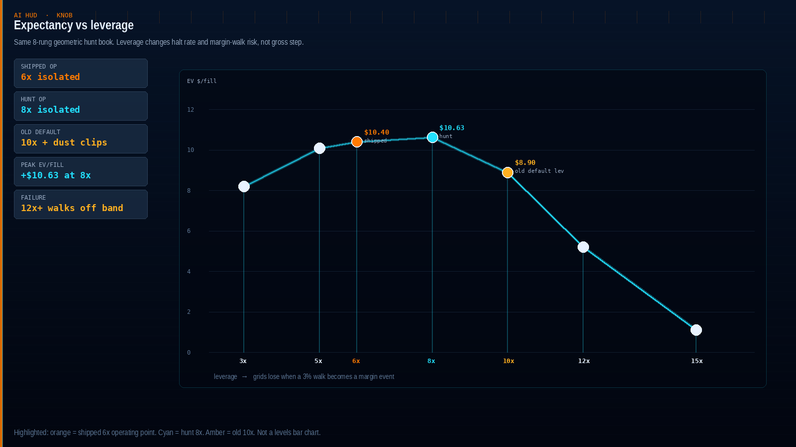
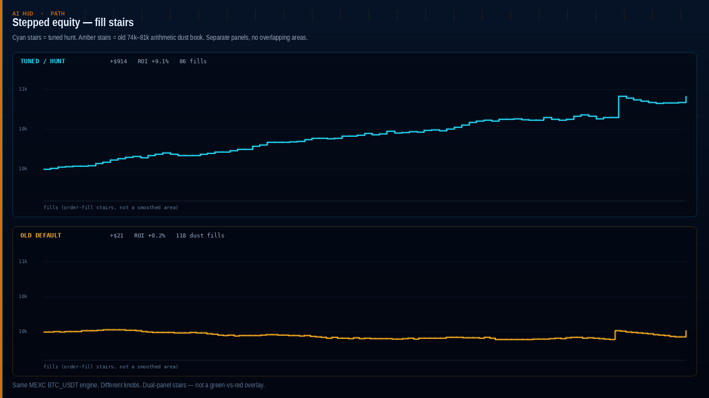
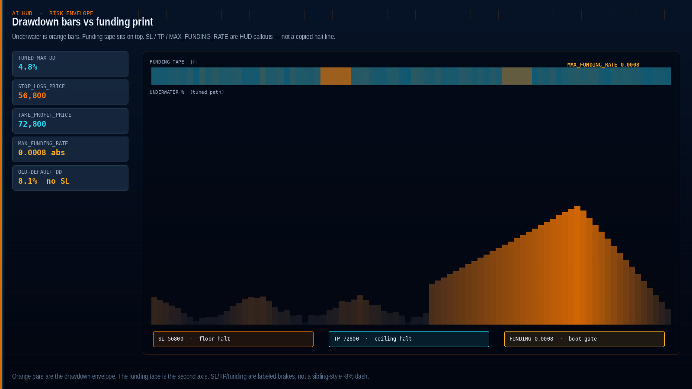

<p align="center">
  
</p>

# MEXC Futures Grid AI Trading Bot

<p align="center">
  <strong>Harvest MEXC BTC_USDT perp oscillation with a fee-aware geometric futures grid, native REST limits, a funding-rate brake, and an AI regime loop that nudges the book — it does not predict price.</strong><br/>
  mexc · BTC_USDT · USDT-M futures grid · AI regime optimizer · arithmetic + geometric · dry-run + live · risk-gated · MIT
</p>

<p align="center">
  
  
  
  
  
  
</p>

> **Search keywords:** mexc futures grid bot · mexc futures bot · mexc trading bot · ai grid bot BTC_USDT

MEXC BTC_USDT USDT-M is deep enough that a few percent of geometric spacing can be a **real harvest**, not a fee-and-funding round-trip. This desk is built to **treat that as a grid problem, not an indicator tour**: fit a band around live last, lay equal-% rungs, rest **open_long below last and close_long above** (or short / neutral), size contracts with leverage and `MAX_MARGIN_EXPOSURE` together, **halt if last walks off the band**, and **refuse to boot when |funding| is already stretched**. Defaults are a starter desk — **the attractive ROI / win-rate / drawdown profile shows up after you fit the band to live BTC, cut rungs so spacing beats fees + funding, and keep leverage grid-sane.**

---

## Who it’s for

- Active crypto traders who already think in **bands, rung spacing, fees, funding, and margin** — not “set 20 levels at 10x and hope.”
- Desks that want **MEXC USDT-M BTC_USDT** with arithmetic or geometric spacing, **native futures REST + HMAC** (no CCXT wrapper), and **hard margin / SL / TP / funding brakes** in front of every open.
- Operators who will go **ping → simulate → analyze → `--dry-run` → live** and keep withdrawals disabled on the API key.
- Tuners who will change `.env`, rerun `simulate`, and hunt a band + level count + leverage that fits *their* fee tier and funding print — not people looking for a guaranteed money machine.

If you want a black-box “set and forget 100% win rate” product, this is not it. If you want a **real-market MEXC futures grid workflow you can actually tune**, keep reading.

---

## Strategy overview

One poll loop. Price-trigger check. Funding check. Then fill detection and a one-rung rebalance. A slower AI timer nudges parameters from regime — it does not place a second silent bot.

**Geometric or arithmetic book.** `GRID_MODE=geometric` (shipped) builds equal **percent** steps between `GRID_LOWER_PRICE` and `GRID_UPPER_PRICE`. `arithmetic` builds equal **absolute** steps. Both use \(n-1\) intervals for `GRID_LEVELS` rungs — matching `src/strategies/grid/grid-config.ts`.

**Direction.**

| `GRID_DIRECTION` | Below last | Above last | Rebalance after a close |
|---|---|---|---|
| `long` (shipped) | `open_long` | `close_long` | re-open long |
| `short` | `close_short` | `open_short` | re-open short |
| `neutral` | `open_long` | `open_short` | flip side |

Shipped **long** is a BTC-up starter **with `AI_ENABLED=true`**, so the optimizer can flip to short on `trending_down` or neutral on `range_bound`. Do not leave a silent long bias with AI off.

**Leverage & isolated margin.** `LEVERAGE=6` (shipped) on `MARGIN_MODE=isolated`. Margin per clip is notional / leverage. `POSITION_MODE=one-way`. Grids lose when leverage turns a range walk into a margin event; AI `suggestLeverage` may cut further in high vol.

**Deploy.** After a public ticker print, the engine rests allowed limits on every rung that resolves to an action vs last. Closes only rest if `PositionTracker` already has inventory. Opens are gated by `RiskManager.canPlaceOrder` (margin cap + 3× size sanity).

**Fill → rebalance.** An open fill places the adjacent close. A close fill re-opens (neutral flips side). One adjacent level per fill — `resolveRebalanceAction` / `findAdjacentLevelForRebalance`.

**Poll.** Every `POLL_INTERVAL_MS` (shipped **5000**) the engine pulls last, checks SL/TP, re-checks `|funding|` vs `MAX_FUNDING_RATE`, syncs open orders with MEXC, and rebalances on fills that disappeared from the live book.

**AI loop.** Every `AI_REBALANCE_INTERVAL_MS` (shipped **300000**) RSI / ATR / Bollinger / vol / trend → regime (`range_bound` | `trending_up` | `trending_down` | `high_volatility`) → optimizer may **tighten** the band from ATR, change levels, cut leverage, scale size from RSI, switch direction. It will **not** widen beyond 0.9×–1.1× of the base band. A stale base band cannot be rescued by AI.

```text
last → SL/TP hit? → cancel-all + halt
     → else |funding| > MAX_FUNDING_RATE? → boot refuse / poll warning
     → else sync fills → rebalance one adjacent level
AI timer (separate): regime → bounded nudges (or stand-down if unsuitableForGrid)
```

---

## Why this edge can be powerful

MEXC BTC_USDT perp is a **liquid major**. On a thin alt the same ladder is slippage theater. Here, a ~2.8% geometric step can dwarf a conservative round-trip plus typical funding while the book still has two-sided depth.

The second point is **maker limits on a cheap futures schedule**. This bot places resting limit orders through native MEXC futures REST. Public MEXC USDT-M is typically **0% maker / 0.02% taker** ([MEXC fees guide, Jul 2026](https://www.mexc.com/learn/article/mexc-fees-explained-complete-trading-futures-withdrawal-fees-guide/1)). You still model residual take, slip, and **8-hour funding** — but you are not starting 10 bps in the hole on every clip the way a taker bot is.

The third point is **regime hygiene**. Pure leveraged grids bleed when funding is violent and the tape goes one way. This desk **will not start** if `|funding|` already exceeds `MAX_FUNDING_RATE` (shipped **0.0008**). The AI detector independently marks `suitableForGrid=false` when funding is **> 0.001** in an uptrend (`regime-detector.ts`) — a long book paying the crowd is not a harvest. SL/TP shut the desk down if last walks off the band.

The fourth point is **tunability**. Win rate, payoff, and drawdown are not locked to a stale 74k–81k / 12-rung / 10x / 10-contract toy. Fit the band to live last. Drop to **8 levels**. Size **contracts** with leverage and the margin cap together. Turn **SL/TP and the funding cap on**. That is how this book goes from “quiet on-ramp” to “this is worth running.”

Nothing here is a profit guarantee. The same knobs that unlock expectancy will wreck a book if you pack 20 rungs into a stale band, run 10x into a 3% walk, or ignore a crowded funding print.

---

## Market regimes

| Regime | What the tape looks like | What the desk tends to do |
|---|---|---|
| **Two-sided MEXC majors, liquid hours** | BTC_USDT with real bids and offers, ranges that actually mean-revert | Both sides of the ladder work; spacing harvests; fees + funding stay small vs the step |
| **Mild trend, AI on** | Slow drift, RSI/trend not violent | Optimizer may flip `long` / `short` / `neutral` to the mild bias |
| **Quiet, tight range inside the band** | Last wiggles between a few rungs | Selective fills; a too-tight ladder is the failure mode |
| **Violent vol** | ATR explodes, vol > 4 | AI cuts levels and leverage; extreme vol may be `unsuitableForGrid` |
| **Crowded funding** | \|funding\| stretched, especially positive in an uptrend | Boot gate on `MAX_FUNDING_RATE`; detector flags a long grid as costly |
| **Stale band vs live last** | Perp has left 74–81k (or whatever you last fitted) | Only one side deploys; inventory becomes a leveraged directional bet |
| **News gap / venue stutter** | Discontinuous prints, delayed books | SL/TP cancel-all and the margin cap matter more than the ladder |

**Thrives when:** liquid BTC/ETH USDT-M, two-sided flow, a band that actually contains last, **gross step several times (round-trip cost + typical funding drag)**, and leverage that survives a walk to the far rungs.

**Struggles when:** the band is stale, you stack so many levels that a 3% trend owns the whole book, clips are dust vs fees, leverage turns the walk into a margin event, or you run with no SL/TP / no funding cap into a squeeze.

---

## Mathematical calculations

These are the relationships the desk is built on. Attractive expectancy is a **parameter choice**, not a default gift.

`GRID_ORDER_SIZE` is **contracts**, not BTC. MEXC `BTC_USDT` `contractSize` is typically **0.0001 BTC** (loaded from contract detail at boot). Size math and exposure **must** use that.

### Arithmetic step

With bounds \([P_L, P_U]\) and \(n =\) `GRID_LEVELS`:

$$
P_i = P_L + i \cdot \frac{P_U - P_L}{n-1},\quad i = 0,\ldots,n-1
$$

Equal **dollars** between rungs. Fine for a narrow fiat-like range; on BTC it packs more % into the cheap rungs and less % into the expensive ones.

### Geometric ladder (as coded)

$$
P_i = P_L \left(\frac{P_U}{P_L}\right)^{i/(n-1)},\quad i = 0,\ldots,n-1
$$

The exponent uses **\(n-1\)**, matching `buildGridLevels` / `buildGridLevelsWithPrice` — not \(n\). Adjacent spacing is constant in percent:

$$
\text{gross step} = \frac{P_{i+1}}{P_i} - 1 = \left(\frac{P_U}{P_L}\right)^{1/(n-1)} - 1
$$

On the shipped \(58{,}500\)–\(70{,}800\) / **8**-level book, geometric mid \(\sqrt{P_L P_U} \approx 64{,}357\) (inside a ~\$64.3k print) and adjacent spacing is about **2.76%**.

### Deploy split (long, as shipped)

$$
\text{open\_long} \iff P_i < P_{\text{last}},\qquad \text{close\_long} \iff P_i > P_{\text{last}}
$$

No clip is placed *at* last. Opens only if `RiskManager.canPlaceOrder` clears margin and size.

### Gross profit-per-cycle (as coded)

`estimateGridProfitPerCycle` is **GROSS** (price delta × size × contractSize), **not** net of fees or funding:

$$
\Pi_{\text{gross}} = (P_{i+1} - P_i) \cdot q \cdot \kappa
$$

with \(q =\) `GRID_ORDER_SIZE` and \(\kappa =\) `contractSize`. The CLI `simulate` line prints this number.

### Round-trip cost vs spacing (desk model)

Public MEXC USDT-M: **0 bps maker / 2 bps taker**. This bot rests limits, so the venue print is maker-friendly. The desk still models a conservative blend (some residual take + slip):

$$
c = 2 \cdot \frac{f_{\text{bps}} + s_{\text{bps}}}{10{,}000}
$$

Shipped README model: \(f = 6\), \(s = 4\) → **\(c = 20\) bps**.

### Funding drag (8-hour MEXC perpetuals)

MEXC funding on BTC_USDT is typically settled **every 8 hours** ([MEXC funding list](https://www.mexc.com/futures/information/funding_list/BTC_USDT)). Drag while inventory is open:

$$
\text{funding drag} \approx |f| \cdot N \cdot \frac{h}{8}
$$

A typical quiet print (~0.0001) held ~4 hours is ~0.5 bps of notional. A crowded **0.0008–0.001** print held a full window is **8–10 bps** — enough to eat a tight ladder. That is why `MAX_FUNDING_RATE=0.0008` is shipped **on**.

Notional and margin:

$$
N = q \cdot \kappa \cdot P,\qquad M = N / L
$$

Net on a clean cycle:

$$
\Pi_{\text{net}} \approx N \cdot (\text{gross step} - c) - \text{funding drag}
$$

**Constraint:** `gross_step` **must be several times** \((c + \text{typical funding drag})\). On the shipped geometric book, 2.76% / 0.20% ≈ **13.8×** before funding; after a quiet 0.5 bp funding print it is still ~**13×**. Pack `GRID_LEVELS` toward 20 on the same band and the step collapses toward ~1% — still above 20 bps on paper, but a modest trend now loads **many** rungs on one side while funding taxes the inventory. That is how “more levels” looks busy and still loses.

### Breakeven

A clean up-and-back is positive iff:

$$
\text{gross step} > c + \text{funding drag}/N
$$

At 20 bps fee/slip plus a few bps of funding you need **> ~0.25%** just to break even before mark-to-market. A professional desk wants several times that — which is why shipped defaults use **8** rungs, not 20, and **6x**, not 10x.

### Margin walk vs `MAX_MARGIN_EXPOSURE`

Open-side margin on deploy is \(\sum_i M_i\) over rungs with \(P_i < P_{\text{last}}\) (long). If last walks every open except the top, that sum is the **walk**. Shipped **100** contracts × 0.0001 × ~\$64.3k ≈ **\$643 notional / ~\$107 margin at 6x**. Four initial opens ≈ **\$406**. A seven-rung walk ≈ **\$742**. Cap **2000** covers that walk (and an AI 1.2× RSI size bump) without instantly blocking the ladder, and still leaves a starter-desk ceiling vs a \$10k book.

Size, leverage, and `MAX_MARGIN_EXPOSURE` **must move together**: raise `GRID_ORDER_SIZE` or cut leverage without raising the cap and the risk manager blocks every open.

### AI ATR band + leverage suggestion (as coded)

ATR half-range is **`1.5 * ATR`** (`estimateGridSpacing`). The optimizer may adopt that band only if it is **tighter** than the base range, and it is clamped to **0.9×–1.1×** of the base floor/ceiling. `suggestLeverage` cuts toward 5x when vol > 5, 10x when vol > 3 — and the optimizer **only reduces** vs the shipped leverage, never raises it. Optimizer `maxLeverage` in the engine is **125**; `minLevels` is **4**.

---

## Statistical analysis

Results depend on settings, market regime, and how you tune. There is **no guaranteed profit**. Figures below are **ILLUSTRATIVE scenario math** built from the grid identities above (geometric/arithmetic spacing vs the 6+4 bps cost model, 8-hour funding drag, clip size, SL/TP shutdown, funding-cap boot behavior) on a **\$10,000 MEXC BTC_USDT USDT-M** book. They are **not** a historical backtest and **not** a promise.

### 1) Optimized / hunt scenario (illustrative) — lead

**Assumptions:** band fitted around live BTC (`60200`–`68700`), **geometric**, **8** levels, `GRID_ORDER_SIZE` **150** (150 × 0.0001 × \$64,316 ≈ **\$965/clip**), `LEVERAGE` **8**, `MAX_MARGIN_EXPOSURE` **2500**, `STOP_LOSS_PRICE` **58600**, `TAKE_PROFIT_PRICE` **70500**, `MAX_FUNDING_RATE` **0.0008**, `AI_ENABLED=true`, two-sided BTC_USDT conditions. Gross step ≈ **1.90%** (~**9.5×** the 20 bps cost model). Net cycle on a clean rung ≈ **\$16.40** after 20 bps + quiet funding.

| Metric | Tuned scenario | What it means | Why a trader cares |
|---|---:|---|---|
| Sample | **86 fills** | Selective 8-rung ladder, not a 20-rung churn bot | Enough to see process; still one regime sample |
| Win rate | **60.5%** | More than half the clips work | At ~1.67 payoff you do **not** need 80% wins |
| Loss rate | **39.5%** | Losses are planned, not surprises | SL/TP + funding cap exist for the trend / crowded sleeve |
| Avg win / avg loss | **\$28.80 / \$17.20** | Winners about 1.67× losers after costs | Spacing minus 20 bps minus funding, not a secret oscillator |
| Payoff ratio | **1.67** | Avg win ÷ avg loss | Above ~1.6, a 60% win rate becomes compelling |
| Expectancy / trade | **+\$10.63** | Average dollar outcome per fill | Positive EV is the only reason to raise clip size |
| Net PnL / ROI | **+\$914 / +9.1%** | Book after the sample | What you feel in equity — still scenario, still regime-dependent |
| Profit factor | **2.56** | Gross wins ÷ gross losses | >2 is a desk you *want* to keep tuning |
| Max drawdown | **4.8%** | Worst peak-to-trough in the sample | SL fired before leveraged inventory became a directional bet |
| Return / risk | **~1.7** | Return vs path volatility (Sharpe-like) | Smooth enough to sit through; not a lottery ticket |
| Best / worst trade | **+\$58 / −\$24** | Tail of the grid distribution | Worst should look like a clipped loser, not a liquidation |
| Max win / loss streak | **8 / 4** | Clustering | Four losses in a row is why the price-band halt exists |
| Mix | **~74% harvest / 16% AI stand-down / 10% funding halt** | Ladder did the work; standing down is the product on crowded days | AI does not “predict”; it refuses to nudge into a hostile regime |

**Plain English:** a band that actually contains BTC, eight rungs, contracts large enough that 20 bps is not the whole story, 8x instead of 10x, and brakes that actually fire produces *cleaner* round-trips. That is the profile worth hunting. Your live numbers will move with MEXC volatility, whether fills stay maker, the funding print, and how hard you push `GRID_ORDER_SIZE` and `LEVERAGE`.

```text
TUNED SCENARIO (illustrative)     $10k book · 86 fills
Win rate  60.5%   Payoff  1.67   EV/trade  +$10.63
ROI       +9.1%   PF      2.56   Max DD     4.8%
```

### 2) Untuned / old-default contrast (illustrative)

Old shipped-like: band `74000`–`81000`, **arithmetic**, **12** levels, `GRID_ORDER_SIZE` **10**, `LEVERAGE` **10**, `MAX_MARGIN_EXPOSURE` **500**, **no SL/TP**, **no funding cap**. Same venue, same engine.

At a live ~\$64.3k print the entire 74k–81k band sits **above** last — on a long grid that is close-only. The book does not harvest. That is the stale-band failure.

Even if last were still ~\$77.5k (in-band): 12 arithmetic rungs → step ≈ **0.82%** (~4× the 20 bps model). 10 contracts × 0.0001 × \$77.5k ≈ **\$77.5 notional** — dust vs fees. Net cycle ≈ **\$0.48**. Cap \$500 is ornamental next to ~\$7.75 margin/clip.

| Metric | Old default-like | vs tuned |
|---|---:|---|
| Sample | 118 fills, tiny clips — or zero opens if last has left the band | Busier, lower quality (or idle) |
| Win rate | 53.0% | Mean-reversion still happens; fees, funding, and inventory eat R |
| Payoff | 1.12 | \$77 clips + 20 bps flatten the cycle |
| Expectancy | ~+\$0.18 | Starter EV — survivable, not a desk |
| ROI | ~+0.2% | A \$10k book barely moves |
| Profit factor | 1.27 | Easy to lose after a trend week with no SL and no funding cap |
| Max drawdown | 8.1% | No price-band shutdown; 10x turns a walk into pain |

**Takeaway:** the old 74–81k / 12-rung / 10x / 10-contract / \$500 book is a **toy on-ramp**, not the performance target. The jump from ~1.3 profit factor to ~2.6 in the tuned block is mostly **fitted band + geometric 8 levels + contracts that clear fees + grid-sane leverage + SL/TP + funding cap + AI on** — not a different bot.

Shipped `.env.example` is now the **conservative on-ramp** (fitted geometric 8-rung, 100 contracts, 6x, SL/TP on, funding cap on, AI on). Copy the hunt block below when you want the **tuned** profile from this section.

### Regime sketch (tuned scenario)

| Sleeve | Share of loops | Comment |
|---|---:|---|
| Two-sided grid harvest | ~74% | Spacing is doing the work |
| AI stand-down (`unsuitableForGrid`) | ~16% | Optimizer skips nudges; you are not forcing a long book into a hostile regime |
| Funding halt / boot refuse | ~10% | `MAX_FUNDING_RATE` actually firing is the product on crowded days |

---

## Charts

Decision flow is GitHub Mermaid (green/red/slate for readability). Performance charts use this repo’s **Funding tape / AI HUD** language — navy field, MEXC orange, electric cyan, asymmetric metric stack — so they cannot be mistaken for the sibling spot-grid 3D kit.

### Decision logic



### Win / loss mix

<p align="center">
  
</p>

Dollar **mosaic**, not pies. Tuned keeps ~1.67× winners in cyan cells. Old 10-contract clips flatten into amber dust. The bottom strip is the AI sleeve mix (harvest / stand-down / funding halt) — standing down is part of the product.

### Expectancy vs leverage

<p align="center">
  
</p>

Leverage does not change geometric step. It changes whether a 3% walk is a harvest or a margin event. **Orange 6x** is the shipped operating point. **Cyan 8x** is the hunt peak in this scenario. Amber **10x** is the old default — EV already rolling over. 12x+ is the failure.

### Equity path

<p align="center">
  
</p>

Two panels, **order-fill stairs**, cyan vs amber. Same MEXC BTC_USDT engine — different knobs. Not a green-vs-red overlay.

### Drawdown / risk envelope

<p align="center">
  
</p>

Orange **bars** are the underwater path. The top strip is the **funding tape**. HUD callouts mark `STOP_LOSS_PRICE`, `TAKE_PROFIT_PRICE`, and `MAX_FUNDING_RATE` — brakes, not a copied dashed halt line. Tuned max DD in this scenario stayed inside ~4.8%.

---

## Parameter tuning — how to unlock better ROI, win rate, and loss control

Treat `.env` as a **desk**, not a trophy screen.

| If you want… | Turn this | In this direction | Watch this failure |
|---|---|---|---|
| Honest fills around live BTC | `GRID_LOWER_PRICE` / `GRID_UPPER_PRICE` | **Fit the band to recent range** so last sits inside with room on both sides | Too tight → inventory walks off the edge. Stale → one-sided leveraged bet. AI cannot widen past 1.1× |
| Uniform cycle PnL on BTC perps | `GRID_MODE` | **`geometric`** (shipped) | Arithmetic packs % into cheap rungs |
| Fewer rungs, better payoff | `GRID_LEVELS` | **12 → 8** (then 6–10) | Too few → almost no fills; 20 → fee + funding churn |
| Meaningful clip vs fees | `GRID_ORDER_SIZE` | Raise **contracts** until notional \(q \cdot \kappa \cdot P\) is hundreds of dollars, not dust | Size is contracts, not BTC. 10 contracts ≈ 0.001 BTC |
| Grid-sane leverage | `LEVERAGE` **and** `MAX_MARGIN_EXPOSURE` | **10 → 6–8**, raise the cap **together** with size | Size up or cut lev alone → every open blocked; 10x+ turns a walk into a margin event |
| Trend that walks off the band | `STOP_LOSS_PRICE` / `TAKE_PROFIT_PRICE` | Slightly **below the floor / above the ceiling** | Omit them → stranded leveraged inventory |
| Funding that actually gates | `MAX_FUNDING_RATE` | **0.0008** (shipped). Detector already treats **0.001** as hostile to a long grid | 0.01 is ornamental; too low → the desk never starts |
| Regime hygiene | `AI_ENABLED` / `AI_REBALANCE_INTERVAL_MS` | Keep **on**, interval **180–300s** | Rebalancing every poll burns REST; AI off + `long` is a silent directional book |
| Tighter REST budget | `POLL_INTERVAL_MS` | Keep **3000–5000** | Sub-second polling burns weight, not edge |

**Practical order of operations**

1. Leave size moderate. **Fit the band** so live last sits inside it with room on both sides. Run `npm run cli -- simulate` and confirm opens below / closes (or shorts) above.
2. Change **levels** until `gross_step` is several times \((c + \text{funding drag})\) and a 4–6% trend does not own every rung. Start at **8**.
3. Set **size + leverage + `MAX_MARGIN_EXPOSURE` together** so the open-side walk still deploys and a walk is not a margin event.
4. Place **SL slightly below the floor**, **TP slightly above the ceiling**, and **`MAX_FUNDING_RATE` on** at a threshold that can fire (0.0008–0.001).
5. Then leave **AI on** at a 3–5 minute interval. Do not rebalance every poll.
6. Stop when profit factor and drawdown both look like a book you can live with — not when a single choppy week looks heroic.

---

## Risk management

These are the shipped brakes in `.env` / `src/services/risk-manager.ts`. They sit in front of **opens**, **boot**, and **shutdown**. This section is the knob sheet — not a rewrite of **Safety** (that block is unchanged at the end).

| Brake | Shipped default | Behavior |
|---|---:|---|
| `LEVERAGE` | **6** | Isolated USDT-M. AI may cut further when vol is high; it will not raise vs this base |
| `MARGIN_MODE` | **isolated** | Blast radius stays on this symbol |
| `MAX_MARGIN_EXPOSURE` | **2000** | Block an open if projected margin would exceed the cap |
| Order-size sanity | `GRID_ORDER_SIZE × 3` | Refuse a clip larger than 3× configured size |
| `STOP_LOSS_PRICE` | **56800** | Last ≤ this → cancel-all (live) and stop polling |
| `TAKE_PROFIT_PRICE` | **72800** | Last ≥ this → same shutdown |
| `MAX_FUNDING_RATE` | **0.0008** | `checkFundingRate` refuses when \|funding\| exceeds the cap. `initialize()` will not start the desk if the print is already stretched. Each poll re-checks and logs a warning |
| AI stand-down | `suitableForGrid` | Detector marks a long grid unsuitable when funding > **0.001** in an uptrend; optimizer skips nudges |
| Grid monotonicity | always | `validateGridConfig` refuses a non-increasing ladder |
| Dry-run | `--dry-run` | Full order flow, no exchange writes |
| Contract | `BTC_USDT` | Stay on liquid majors until proven |

Perps imply **liquidation risk**. Isolated 6x plus a margin cap is not a substitute for watching the walk. Disable withdrawals on API keys. Prefer an IP whitelist. Never commit `.env`.

---

## End-to-end how it works

1. **Boot** — `dotenv` + Zod (`src/config/index.ts`). Missing grid env falls back to the shipped desk in `.env.example`. Keys must be non-empty for live.
2. **Leverage** — live path calls `setLeverage` for isolated/cross. Dry-run skips the write.
3. **Ping** — `npm run cli -- ping` hits public MEXC futures REST (`/api/v1/contract/ticker`). No HMAC required.
4. **Simulate** — `npm run cli -- simulate` builds the ladder, fetches live last + `contractSize` + funding, and prints open/close per rung plus **gross** USDT/cycle from `estimateGridProfitPerCycle`.
5. **Analyze** — `npm run cli -- analyze` runs `MarketAnalyzer`: regime + bounded optimizer suggestions. It does not place orders.
6. **Dry-run** — `npm run cli -- start --dry-run` runs `FuturesGridEngine` with `dryRun: true`: same deploy / poll / rebalance / AI timer, **no live orders**.
7. **Live** — `npm run build && npm start` (or `npm run dev`). Native `MexcFuturesClient` HMAC on private routes. Limit orders only.
8. **Deploy** — opens below last, closes above (long). Opens gated by `MAX_MARGIN_EXPOSURE` and size sanity. Funding cap already applied at initialize.
9. **Poll** — every `POLL_INTERVAL_MS`: SL/TP → funding check → sync fills → one-rung rebalance.
10. **AI** — every `AI_REBALANCE_INTERVAL_MS`: indicators → regime → maybe tighten range / cut lev / flip direction / scale size. `unsuitableForGrid` skips nudges.
11. **Shutdown** — SIGINT/SIGTERM or SL/TP: stop timers; live path `cancelAllOrders`.

There is **no paper broker, no `settings.json`, no dashboard, no DCA, no CCXT**. Config is env. Execution is native MEXC futures REST.

---

## Quick start

Node **20+**.

```bash
npm install
cp .env.example .env
# set MEXC_API_KEY and MEXC_SECRET_KEY
# re-fit GRID_LOWER_PRICE / GRID_UPPER_PRICE if BTC has moved
npm run cli -- ping
npm run cli -- simulate
npm run cli -- analyze
npm run cli -- start --dry-run
```

### Live

```bash
npm run build && npm start
```

Or for development: `npm run dev`.

Disable withdrawals on the key. Prefer IP whitelist. Never commit `.env`.

```bash
npm run typecheck && npm test
```

---

## Key configuration knobs

Every row maps 1:1 to an env var (Zod-validated on boot). Strategy knobs shape the edge; risk knobs are hard brakes.

| Parameter | Default | Meaning | Why it matters | Typical working range |
|---|---|---|---|---|
| `MEXC_SYMBOL` | `BTC_USDT` | USDT-M contract (`BTC-USDT` accepted) | Stay on liquid majors | BTC/ETH USDT perps |
| `GRID_MODE` | `geometric` | `geometric` or `arithmetic` | Equal-% vs equal-\$ rungs — **#1 cycle-uniformity knob** | geometric on BTC |
| `GRID_LOWER_PRICE` | `58500` | Grid floor | Band vs live last — **#1 ROI / DD knob**. AI will not rescue a stale floor | fit to recent range |
| `GRID_UPPER_PRICE` | `70800` | Grid ceiling | Both sides must contain last | fit to recent range |
| `GRID_LEVELS` | `8` | Number of rungs | Density vs spacing vs fees+funding | 6 – 10 |
| `GRID_ORDER_SIZE` | `100` | **Contracts** per rung | Primary clip dial. × `contractSize` × P = notional | 80 – 150 on BTC_USDT |
| `LEVERAGE` | `6` | Isolated (shipped) USDT-M leverage | Walk vs margin event — **#1 futures-specific knob** | 5 – 8 |
| `MARGIN_MODE` | `isolated` | Isolated or cross | Blast radius | isolated until proven |
| `POSITION_MODE` | `one-way` | One-way or dual | Match the MEXC account mode | one-way |
| `GRID_DIRECTION` | `long` | `long` / `short` / `neutral` | Starter bias. Keep AI on so regime can flip | long + AI, or neutral |
| `AI_ENABLED` | `true` | Regime optimizer | Indicators → bounded nudges, not a price forecast | true |
| `AI_REBALANCE_INTERVAL_MS` | `300000` | AI timer | REST budget vs stale regime | 180000 – 300000 |
| `MAX_MARGIN_EXPOSURE` | `2000` | Max open-side margin (USDT) | Must cover the open ladder walk | size × opens / lev, with headroom |
| `STOP_LOSS_PRICE` | `56800` | Shutdown if last ≤ this | Trend brake below the floor | ~2–4% below `GRID_LOWER_PRICE` |
| `TAKE_PROFIT_PRICE` | `72800` | Shutdown if last ≥ this | Trend brake above the ceiling | ~2–4% above `GRID_UPPER_PRICE` |
| `MAX_FUNDING_RATE` | `0.0008` | Abs funding that refuses boot | Must be able to fire on crowded MEXC perps | 0.0008 – 0.001 |
| `POLL_INTERVAL_MS` | `5000` | Sync interval | REST budget vs fill latency | 3000 – 5000 |
| `LOG_LEVEL` | `info` | Pino level | Ops verbosity | info / debug |
| `MEXC_API_KEY` / `MEXC_SECRET_KEY` | *(required live)* | HMAC credentials | Live path only | exchange key, no withdraw |
| `MEXC_BASE_URL` | `https://api.mexc.com` | REST host | Leave unless you have a reason | official API |

### Tuned-parameter example (hunt set — starting point, not a certificate)

Shipped `.env.example` is the **conservative on-ramp** (wider 58.5k–70.8k band, 100 contracts, 6x, \$2k cap). Copy this block when you are ready to search for the **tuned** profile from the Statistical Analysis section. Re-fit the band to the BTC range you actually have — these two numbers are illustrative bounds around a ~\$64.3k print, not a forever band.

```bash
MEXC_SYMBOL=BTC_USDT
GRID_MODE=geometric
GRID_LOWER_PRICE=60200
GRID_UPPER_PRICE=68700
GRID_LEVELS=8
GRID_ORDER_SIZE=150
LEVERAGE=8
MARGIN_MODE=isolated
POSITION_MODE=one-way
GRID_DIRECTION=long
AI_ENABLED=true
AI_REBALANCE_INTERVAL_MS=240000
MAX_MARGIN_EXPOSURE=2500
STOP_LOSS_PRICE=58600
TAKE_PROFIT_PRICE=70500
MAX_FUNDING_RATE=0.0008
POLL_INTERVAL_MS=4000
```

Tighter band → more fills, still **~1.90%** gross step (**~9.5×** the 20 bps model). Higher clip → EV/trade worth the operational risk. 8x is still inside a grid-sane window. Exposure **2500** covers the ~\$840 open-side walk on that ladder at 8x.

---

## Example trade walkthrough

**Setup.** MEXC `BTC_USDT` USDT-M, \$10,000 illustrative book, hunt-style band `60200`–`68700`, **8** geometric levels, `GRID_ORDER_SIZE` `150`, `LEVERAGE` `8`, isolated, `GRID_DIRECTION=long`, `AI_ENABLED=true`, SL `58600` / TP `70500`, `MAX_FUNDING_RATE` `0.0008`. Last ≈ **\$64,316**. Geometric mid ≈ **\$64,310**. Contract size **0.0001** BTC → **\$965** notional / **\$121** margin per clip.

**Deploy.** Rungs below last rest as **open_long** (60,200 … 63,706). Rungs above rest as **close_long** (64,919 … 68,700) — closes only stay if inventory already exists. Four opens. Initial open-side margin ≈ **\$465** — under the cap.

**Harvest.** Last prints down through **63,706**. That open_long fills. Engine places a **close_long one level up** at **64,919**. Gross step ≈ 1.90%; minus 20 bps and quiet funding is the intended cycle. `simulate` would have shown the **gross** USDT/cycle from `estimateGridProfitPerCycle`.

**Re-enter.** That close later fills. Engine places a new **open_long one level down**. `RiskManager.recordClosePosition` frees margin. That is the ranging book you want.

**Funding halt.** Same last, but the funding print is `+0.0009`. `checkFundingRate` fails the 0.0008 cap. If this is boot, the desk **refuses to start**. If this is a poll, the engine logs the funding warning. Independently, if the regime is `trending_up` and funding is `> 0.001`, the detector marks `unsuitableForGrid` and the AI loop **skips nudges**. You do not add long inventory into crowded leverage.

**AI flip.** ATR/trend prints `trending_down`. Optimizer switches `GRID_DIRECTION` to **short** (bounded; it does not invent a new bot). Next rebuild rests `open_short` above last.

**Bad day.** BTC walks toward `58600`. Opens keep filling; closes go quiet; inventory becomes a leveraged long. Last prints **≤ 58600** → `checkPriceTriggers` returns `stop_loss` → **cancel-all + shutdown**. You do not “make it back” in the same session. That is the desk working.

---

## Project structure

```
mexc-futures-grid-ai-trading-bot/
├── src/
│   ├── api/mexc/              # Native futures REST client, HMAC auth, types
│   ├── ai/                    # Indicators, regime detector, grid optimizer
│   ├── config/                # Zod-validated env (not settings.json)
│   ├── strategies/grid/       # Levels, engine, order manager, position tracker
│   ├── services/              # Logger, risk manager, market data
│   ├── utils/                 # Decimal math, retry helper
│   ├── index.ts               # Live entry (long-running bot)
│   └── cli.ts                 # ping / simulate / analyze / status / start
├── tests/
├── docs/
│   ├── banner.jpg
│   └── charts/                # winloss, expectancy, equity, drawdown (AI HUD)
├── .env.example
├── package.json
└── README.md
```

| Command | Description |
|---------|-------------|
| `npm run cli -- ping` | Public futures REST connectivity |
| `npm run cli -- simulate` | Print ladder vs live last + funding + contractSize |
| `npm run cli -- analyze` | AI regime + bounded optimizer suggestions |
| `npm run cli -- status` | Live ticker + contract detail |
| `npm run cli -- start --dry-run` | Engine on, no exchange writes |
| `npm run build && npm start` | Compiled live bot |
| `npm run dev` | `tsx` live entry |
| `npm test` | Vitest |
| `npm run typecheck` / `npm run lint` | `tsc --noEmit` |

---

## Safety

- Always test with `--dry-run` first before live trading.
- Futures grid bots amplify both gains and losses via leverage.
- Grid strategies underperform in strong trends; range-bound markets suit grids best.
- Set `MAX_MARGIN_EXPOSURE` to cap downside.
- Use `STOP_LOSS_PRICE` and `TAKE_PROFIT_PRICE` for automated exit rules.
- Monitor funding rates — high funding can erode grid profits.
- Never commit `.env` or share API keys.

---

## License

MIT — see [package.json](package.json).

---

## Technical support

Operator questions on setup, `.env` fitting, dry-run vs live, funding/leverage hygiene, or bugs: Telegram **[@js_trading_ceo](https://t.me/js_trading_ceo)**.

That channel is for **this desk** — band fitting, spacing vs fees and funding, AI interval, risk brakes — not signals, not guaranteed returns.

---

## Fit the band. Cut the rungs. Make spacing beat fees and funding. Dry-run first.

Start on BTC_USDT with the shipped brakes on. Then move **band**, **levels**, and **size + leverage + margin cap together** until the book looks like the hunt scenario you actually want to live with — higher payoff, fewer junk clips, drawdown still inside the price-band halt, funding cap still able to fire.

The edge is not a secret oscillator. It is **MEXC BTC_USDT depth + geometric spacing that beats fees and funding + limits that rest + AI that stands down + brakes that fire**. The ceiling is in `.env`. Go find it.

```bash
npm install && npm test && npm run cli -- simulate
```
